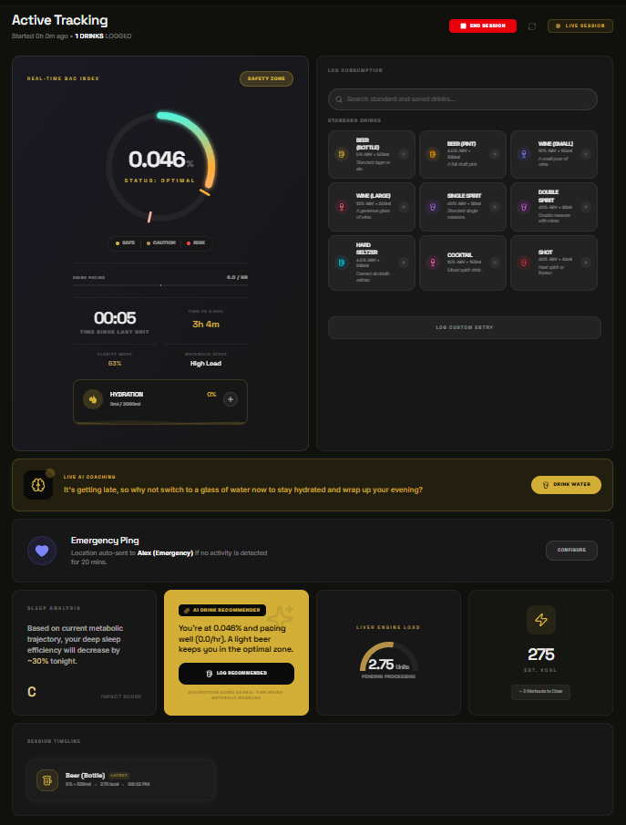
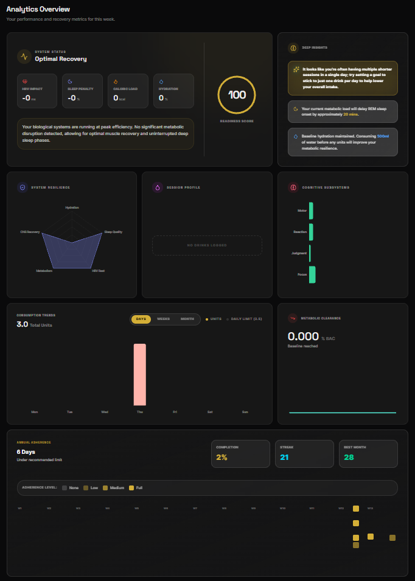
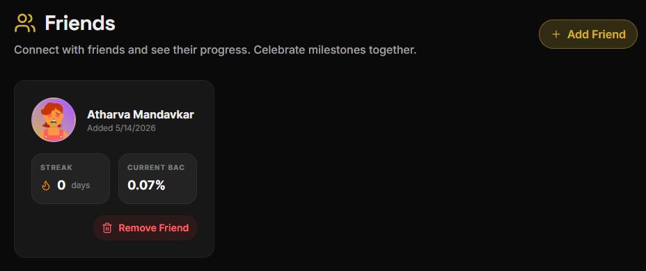
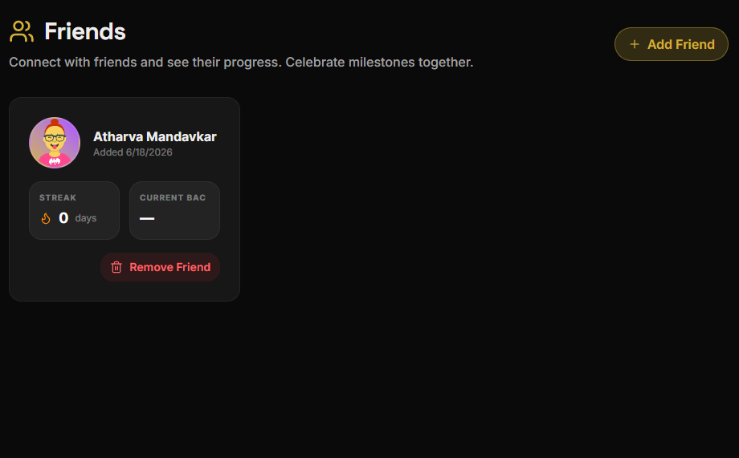
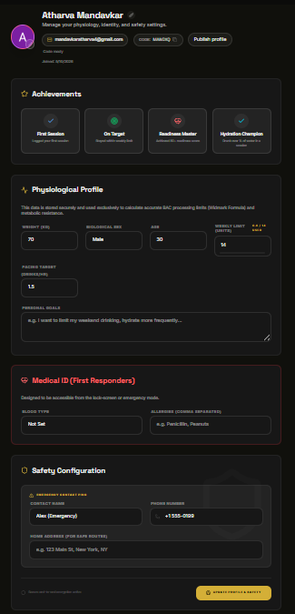

# 🍺 Alcotrax — Mindful Consumption Dashboard

A full-stack web app designed to help users track alcohol consumption, monitor blood alcohol concentration (BAC), connect with friends, and make informed decisions about drinking habits.

**Live Demo:** https://gen-lang-client-0213350901.web.app



---

## 📋 Table of Contents

- [Features](#features)
- [Tech Stack](#tech-stack)
- [Architecture](#architecture)
- [Prerequisites](#prerequisites)
- [Local Setup](#local-setup)
- [Environment Variables](#environment-variables)
- [Running the App](#running-the-app)
- [Building for Production](#building-for-production)
- [Deployment](#deployment)
- [Firebase Configuration](#firebase-configuration)
- [API Keys & Services](#api-keys--services)
- [Project Structure](#project-structure)
- [Key Features Deep Dive](#key-features-deep-dive)
- [Troubleshooting](#troubleshooting)
- [Contributing](#contributing)
- [License](#license)

---

## ✨ Features

### 🎯 Session Tracking
- **Real-time BAC Calculation**: Uses Widmark formula to calculate blood alcohol concentration
- **Drink Logging**: Add custom or preset drinks with ABV, volume, and calorie tracking
- **Live Metrics**: Monitor peak BAC, units consumed, calories, and hydration in real-time
- **Pacing Alerts**: Get feedback on drinking pace relative to your target

### 👥 Social Features
- **Friend Connections**: Add friends by displaying/searching friend codes
- **Activity Feed**: See friends' completed sessions with engagement (likes/comments)
- **Milestone Badges**: Earn achievements for session milestones
- **Friend Requests**: Accept/decline friend connection requests

### 📊 Analytics & History
- **Session History**: Review all past sessions with detailed metrics
- **Weekly Analytics**: Track weekly unit consumption against your limit
- **Readiness Score**: See your estimated time to sobriety
- **Export Session Data**: Generate shareable session summary images

### 🛡️ Safety & Medical
- **Emergency Contact**: Store and quickly access emergency contact info
- **Medical ID**: Blood type, allergies, and emergency details (lock-screen accessible)
- **Safe Routes**: Generate safe routes home from your location
- **BAC-Based Warnings**: Get alerted when BAC exceeds safe limits

### 🤖 AI-Powered Features
- **Drink Suggestions**: AI-generated drink recommendations using Google Gemini
- **Personalized Coaching**: Real-time guidance based on your drinking patterns
- **Safe Consumption Tips**: AI-generated safety tips during sessions

### 📱 Responsive Design
- **Mobile-First UI**: Fully responsive design for phones, tablets, and desktops
- **Offline Support**: Session data persists locally; syncs when online
- **Cross-Device Sync**: BroadcastChannel for real-time sync across browser tabs

---

## 🏗️ Tech Stack

### Frontend
- **React 19** — UI library
- **TypeScript** — Type safety
- **Vite 6** — Build tool & dev server
- **Tailwind CSS 4** — Styling
- **Framer Motion** — Animations
- **React Router 7** — Routing
- **Recharts** — Data visualization
- **Lucide React** — Icon library
- **html-to-image** — Session export

### Backend & Database
- **Firebase Authentication** — User auth (Google, Email/Password)
- **Cloud Firestore** — Real-time NoSQL database
- **Firebase Hosting** — Static site hosting
- **Firebase Security Rules** — Data access control

### AI & APIs
- **Google Gemini API** — AI coaching and suggestions
- **Google Maps API** — Safe route navigation
- **Web Share API** — Native share functionality

### Development
- **Node.js 20+** — Runtime
- **npm** — Package manager
- **TypeScript** — Type checking
- **ESLint** (optional) — Code linting

---

## 🏛️ Architecture

### System Overview
```
┌─────────────────────────────────────────────────────────────┐
│                    ALCOTRAX SYSTEM                          │
├─────────────────────────────────────────────────────────────┤
│                     React Vite SPA                          │
│  ┌──────────────────────────────────────────────────────┐   │
│  │  Pages: Dashboard | Analytics | Friends | Profile   │   │
│  │  Components: Session Tracker | Feed | Charts        │   │
│  │  State: SessionContext | AuthContext                │   │
│  └──────────────────────────────────────────────────────┘   │
├─────────────────────────────────────────────────────────────┤
│                  Firebase Backend                          │
│  ┌──────────────────────────────────────────────────────┐   │
│  │ Auth: Google Sign-In, Email/Password               │   │
│  │ Firestore Collections:                             │   │
│  │  • users/{uid}                                     │   │
│  │  • profiles/{uid}                                  │   │
│  │  • publicProfiles/{uid} (for friend search)        │   │
│  │  • friendCodes/{code} (code index)                 │   │
│  │  • activeSessions/{uid}                            │   │
│  │  • sessionHistory/{sessionId}                      │   │
│  │  • userFriends/{friendshipId}                      │   │
│  └──────────────────────────────────────────────────────┘   │
├─────────────────────────────────────────────────────────────┤
│              External Services                             │
│  • Google Gemini API (AI Coaching)                         │
│  • Google Maps (Safe Routes)                              │
└─────────────────────────────────────────────────────────────┘
```

### Data Flow
1. **User Signs In** → Firebase Auth → SessionContext loads profile
2. **User Logs Drink** → Local state updates → Real-time BAC calculated
3. **Session Ends** → Data written to Firestore → Synced across devices
4. **Friend Search** → Query publicProfiles + friendCodes collections
5. **Feed Updates** → onSnapshot listeners on sessionHistory collection

---

## 📋 Prerequisites

Before you begin, ensure you have:
- **Node.js 20+** — Download from [nodejs.org](https://nodejs.org/)
- **npm 10+** (comes with Node.js)
- **Git** — For version control
- **Firebase Project** — Create at [firebase.google.com](https://firebase.google.com)
- **Google Account** — For Firebase and Gemini API

---

## 🚀 Local Setup

### Step 1: Clone the Repository
```bash
git clone https://github.com/Atharva0177/AlcoTrax.git
cd alcotrax
```

### Step 2: Install Dependencies
```bash
npm install
```

### Step 3: Set Up Environment Variables
Create a `.env.local` file in the project root:
```env
VITE_FIREBASE_API_KEY=your_firebase_api_key
VITE_FIREBASE_AUTH_DOMAIN=your_project.firebaseapp.com
VITE_FIREBASE_PROJECT_ID=your_project_id
VITE_FIREBASE_STORAGE_BUCKET=your_project.appspot.com
VITE_FIREBASE_MESSAGING_SENDER_ID=your_sender_id
VITE_FIREBASE_APP_ID=your_app_id
VITE_GEMINI_API_KEY=your_gemini_api_key
```

**How to Get These Values:**
- **Firebase Config**: Go to [Firebase Console](https://console.firebase.google.com) → Project Settings → scroll to SDK setup
- **Gemini API Key**: Visit [Google AI Studio](https://aistudio.google.com/apikey) → Click "Create API Key"

### Step 4: Configure Firebase Locally (Optional — for deploying)
```bash
npm install -g firebase-tools
firebase login
firebase init
```

---

## 🔐 Environment Variables

Create `.env.local` in the project root:

```env
# Firebase Configuration
VITE_FIREBASE_API_KEY=AIzaSyDxxx...
VITE_FIREBASE_AUTH_DOMAIN=gen-lang-client-0213350901.firebaseapp.com
VITE_FIREBASE_PROJECT_ID=gen-lang-client-0213350901
VITE_FIREBASE_STORAGE_BUCKET=gen-lang-client-0213350901.appspot.com
VITE_FIREBASE_MESSAGING_SENDER_ID=123456789
VITE_FIREBASE_APP_ID=1:123456789:web:abcdef123456

# Google Gemini API
VITE_GEMINI_API_KEY=AIzaSyDxxx...
```

### For Production (Hosting Platforms)
Set these same variables in your hosting platform's environment settings:
- **Firebase Hosting**: `firebase deploy --set-env`
- **Vercel**: Project Settings → Environment Variables
- **Netlify**: Site Settings → Build & Deploy → Environment

---

## ▶️ Running the App

### Development Server
```bash
npm run dev
```
Open [http://localhost:3000](http://localhost:3000) in your browser.

The dev server includes:
- ✅ Hot Module Replacement (HMR)
- ✅ TypeScript type checking
- ✅ Instant reload on file changes

### Type Checking
```bash
npm run lint
```
Validates TypeScript without emitting code.

### Build Output
```bash
npm run build
```
Creates production-optimized build in `dist/` directory (~3-4 MB gzipped).

### Preview Production Build
```bash
npm run build && npm run preview
```
Starts a local server serving the production build.

---

## 🏢 Building for Production

### Step 1: Build the App
```bash
npm run build
```

### Step 2: Test the Build Locally
```bash
npm run preview
```

### Step 3: Verify Build Output
```bash
ls -lh dist/
# Should show:
# index.html (~2 KB)
# assets/index-xxxxx.js (~800 KB gzipped)
# assets/index-xxxxx.css (~50 KB gzipped)
```

---

## 🚀 Deployment

### Option 1: Firebase Hosting (Recommended)

**Setup:**
```bash
firebase login
firebase init hosting
```

When prompted:
- Public directory: `dist`
- Single-page app: `Yes`
- Automatic builds: `No`

**Deploy:**
```bash
npm run build
firebase deploy --only hosting
```

**Result:** Your app is live at `https://gen-lang-client-0213350901.web.app`

### Option 2: Vercel (Git-Based)

1. Push to GitHub:
```bash
git add .
git commit -m "Deploy to Vercel"
git push origin main
```

2. Visit [vercel.com](https://vercel.com)
3. Connect GitHub repo
4. Build command: `npm run build`
5. Output directory: `dist`
6. Add environment variables
7. Deploy!

### Option 3: Netlify (Git-Based)

1. Push to GitHub (same as above)
2. Visit [netlify.com](https://netlify.com)
3. Connect GitHub repo
4. Build command: `npm run build`
5. Publish directory: `dist`
6. Add environment variables
7. Deploy!

### Step: Set Up Custom Domain (Optional)
After deployment, add a custom domain in your hosting platform's settings.

---

## ⚙️ Firebase Configuration

### Database Schema

#### Collections

**`users/{uid}`**
- `email: string` — User's email
- `createdAt: number` — Timestamp
- `updatedAt: number` — Last update

**`profiles/{uid}`**
- `userId: string`
- `weight: number` — in kg
- `sex: "M" | "F" | "O"`
- `age: number`
- `weeklyLimit: number` — Standard drinks per week
- `bloodType: string`
- `allergies: array`
- `emergencyContactName: string`
- `emergencyContactPhone: string`
- `homeAddress: string`

**`publicProfiles/{uid}`** (for friend search)
- `userId: string`
- `displayName: string`
- `avatar: string` — Base64 or URL
- `friendCode: string` — 6-char uppercase code
- `searchKey: string` — Lowercase UID for search
- `updatedAt: number`

**`friendCodes/{code}`** (index for fast code lookup)
- `userId: string`
- `friendCode: string`
- `updatedAt: number`

**`sessionHistory/{sessionId}`**
- `userId: string`
- `totalUnits: number`
- `peakBac: number`
- `durationMins: number`
- `drinkCount: number`
- `totalCalories: number`
- `waterVolume: number`
- `timestamp: number`
- `consumedDrinks: array` (optional)

**`activeSessions/{uid}`**
- `userId: string`
- `startTime: number`
- `bac: number`
- `peakBac: number`
- `drinksCount: number`
- `updatedAt: number`

**`userFriends/{friendshipId}`**
- `userId: string` — Friend who added
- `friendUserId: string` — User being added
- `name: string` — Friend's display name
- `avatar: string`
- `addedAt: number`

### Firestore Security Rules

Rules are stored in `firestore.rules` and define:
- ✅ Users can only read/write their own data
- ✅ `publicProfiles` is readable by all signed-in users (for search)
- ✅ `friendCodes` maps codes to userIds
- ✅ Admin access for `users` collection

Deploy rules:
```bash
firebase deploy --only firestore:rules
```

### Enable Google Sign-In

1. Go to [Firebase Console](https://console.firebase.google.com)
2. Authentication → Sign-in method
3. Enable: Google, Email/Password
4. Add your domain to authorized domains

---

## 🔑 API Keys & Services

### Google Gemini API

**Quota:** 60 requests/minute (free tier)

**Setup:**
1. Visit [Google AI Studio](https://aistudio.google.com/apikey)
2. Click "Create API Key"
3. Copy key to `.env.local`

**Usage in App:**
```typescript
// In src/services/AIService.ts
const genAI = new GoogleGenerativeAI(import.meta.env.VITE_GEMINI_API_KEY);
const model = genAI.getGenerativeModel({ model: "gemini-pro" });
const response = await model.generateContent(prompt);
```

### Google Maps API

**Optional** — Only needed for "Safe Routes" feature.

**Setup:**
1. Enable Maps JavaScript API in Google Cloud Console
2. Add API key to your Firebase config

---

## 📁 Project Structure

```
alcotrax/
├── src/
│   ├── pages/                 # Route components
│   │   ├── Dashboard.tsx      # Main session tracking
│   │   ├── Analytics.tsx      # Weekly stats & charts
│   │   ├── Friends.tsx        # Friend search & management
│   │   ├── Profile.tsx        # User profile & settings
│   │   ├── Feed.tsx           # Activity feed
│   │   └── Admin.tsx          # Admin panel
│   │
│   ├── components/            # Reusable components
│   │   ├── Layout.tsx         # Main layout with nav
│   │   ├── DrinkIcon.tsx      # Drink icons
│   │   └── SessionShareImage.tsx
│   │
│   ├── context/               # React Context state
│   │   ├── AuthContext.tsx    # Authentication state
│   │   └── SessionContext.tsx # Session & profile state
│   │
│   ├── services/              # External services
│   │   └── AIService.ts       # Gemini API integration
│   │
│   ├── lib/                   # Utilities
│   │   └── utils.ts           # Helper functions
│   │
│   ├── App.tsx                # Main app router
│   ├── main.tsx               # Entry point
│   ├── index.css              # Global styles
│   ├── firebase.ts            # Firebase config
│   └── types.ts               # TypeScript types
│
├── firebase.json              # Firebase hosting config
├── firestore.rules            # Firestore security rules
├── vite.config.ts             # Vite configuration
├── tailwind.config.ts         # Tailwind CSS config
├── tsconfig.json              # TypeScript config
├── package.json               # Dependencies
└── README.md                  # This file
```

---

## 🎯 Key Features Deep Dive

### BAC Calculation (Widmark Formula)

The app uses a simplified Widmark formula:

```
BAC = (Alcohol Grams / (Body Weight in grams × r)) - (0.015 × Hours Elapsed)

where r (distribution ratio):
  - Male: 0.68
  - Female: 0.55
  - Other: 0.615
```

**Example:**
- 70kg male, 2 beers (10g alcohol each) = 0.028 BAC
- After 1 hour: 0.028 - 0.015 = 0.013 BAC

### Friend Code System

- **Code Format:** 6 uppercase alphanumeric characters (e.g., `ABC123`)
- **Generation:** Deterministic from user ID: `userId.slice(0, 6).toUpperCase()`
- **Storage:** 
  - `publicProfiles/{uid}` — Public display
  - `friendCodes/{code}` — Fast lookup index

**Example Flow:**
1. User publishes profile via "Publish Profile" button
2. Profile written to `publicProfiles/{uid}` and `friendCodes/{code}`
3. Friend searches for code or name
4. Search queries both collections and returns results
5. Friend can add the user

### Activity Feed

- **Data Source:** Real-time listener on `sessionHistory` collection
- **Feed Types:**
  - Own sessions
  - Friends' completed sessions
  - Incoming friend requests
- **Engagement:** Deterministic kudos/support scores (not random)

---

## 🐛 Troubleshooting

### Issue: "Not in a Firebase app directory"
**Solution:**
```bash
firebase init
# Select "Hosting"
# Public directory: dist
# Single-page app: yes
firebase deploy
```

### Issue: Firestore writes rejected with "Missing or insufficient permissions"
**Solution:**
1. Check `firestore.rules` has correct validation
2. Ensure required fields are included in writes
3. Verify user is signed in (`request.auth != null`)

### Issue: Gemini API calls failing
**Solution:**
1. Verify API key in `.env.local`
2. Check quota at [Google AI Studio](https://aistudio.google.com)
3. Ensure API is enabled in Google Cloud Console

### Issue: Friend search returns "No user found"
**Solution:**
1. Ensure friend has clicked "Publish Profile" in their Profile page
2. Both `publicProfiles` and `friendCodes` documents must exist
3. Check Firestore Console for data presence

### Issue: Page is slow on multi-device usage
**Solution:**
- The app is optimized for multi-device sync
- Reduce number of active Firestore listeners if needed
- Check browser DevTools → Network tab for slow requests

---

## 🤝 Contributing

1. Fork the repository
2. Create a feature branch: `git checkout -b feature/your-feature`
3. Commit changes: `git commit -m "Add your feature"`
4. Push to branch: `git push origin feature/your-feature`
5. Open a Pull Request

**Code Style:**
- Use TypeScript for all files
- Follow Tailwind CSS utility-first approach
- Test on mobile before submitting PRs

---

## 📸 Screenshots

### Dashboard — Real-time Session Tracking

*Main interface for logging drinks and monitoring live BAC calculations in real-time*

---

### Analytics — Weekly Stats & Insights

*View your weekly consumption trends, charts, and insights against your daily/weekly limits*

---

### Friends — Search & Connect

*Search friends by name or friend code, view friend profiles, and manage your friend list*

---

### Activity Feed — Social Engagement

*See friends' completed sessions with engagement buttons (like, comment, share), incoming friend requests, and milestones*

---

### Profile — Settings & Safety

*Manage your profile, set consumption limits, add medical info (blood type, allergies), emergency contacts, and publish your profile*

---

## 📝 License

This project is licensed under the MIT License — see LICENSE file for details.

---

## 📞 Support

For questions or issues:
- Open an issue on [GitHub](https://github.com/Atharva0177/AlcoTrax/issues)
- Check existing docs in `docs/` folder
- Review Firestore rules in `firestore.rules`

---

## 🎉 Acknowledgments

Built with:
- ⚛️ React & TypeScript
- 🔥 Firebase ecosystem
- 🎨 Tailwind CSS & Framer Motion
- 🤖 Google Gemini AI
- 💕 Community feedback

---

**Made with ❤️ for mindful consumption.**

---

### Quick Start (TL;DR)

```bash
# Clone
git clone https://github.com/Atharva0177/AlcoTrax.git && cd alcotrax

# Setup
npm install
echo "VITE_FIREBASE_API_KEY=..." > .env.local
echo "VITE_GEMINI_API_KEY=..." >> .env.local

# Run
npm run dev

# Deploy
npm run build && firebase deploy
```

Visit: https://gen-lang-client-0213350901.web.app
